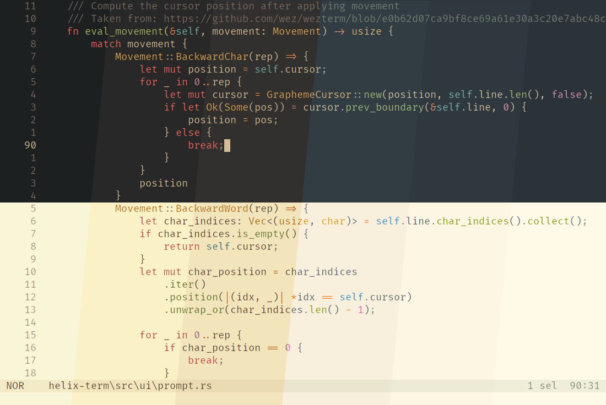

## Helix Themes

Some themes for the [helix editor](https://github.com/helix-editor/helix).

Included themes and variants:

- [Everforest](https://github.com/sainnhe/everforest)
  - Dark
    - Hard
    - Medium
    - Soft
    - HC (customized high contrast version)
  - Light
    - Hard
    - Medium
    - Soft
- [Gruvbox (Material)](https://github.com/sainnhe/gruvbox-material) (all variants: `material` / `mix` / `original`)
  - Dark
    - Hard
    - Medium
    - Soft
  - Light
    - Hard
    - Medium
    - Soft

---

Generate all themes by running `build.sh`.

Or generate a single one:

```bash
cat "themes/gruvbox" "palettes/gruvbox/material_dark_medium" > "theme.toml"
```

