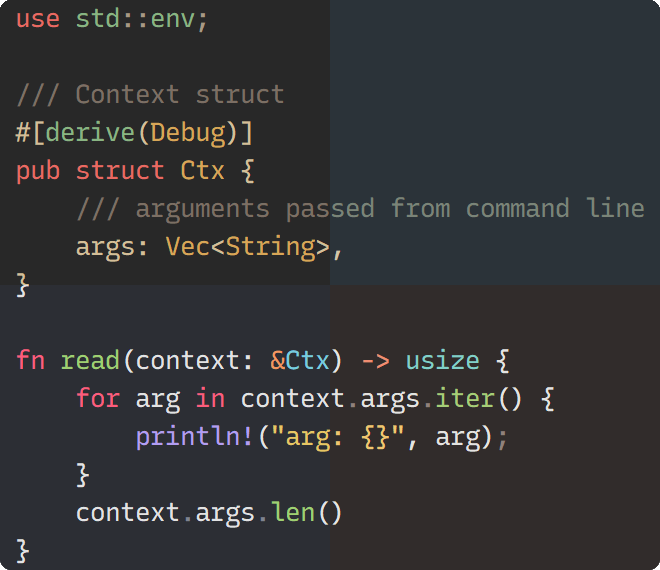

<p align="center">
  
</p>

# Helix Themes

A few themes for the [helix editor](https://github.com/helix-editor/helix). Most of them are direct ports of existing themes.

The included themes generally follow these rules:

- Medium contrast and saturation
- Balanced use of different colors (easily discernable syntax)
- Not too many colors

***For preview images see: [PREVIEWS.md](PREVIEWS.md)***

## Included themes

- [Edge](PREVIEWS.md#edge)
  - Port of [`sainnhe/edge`](https://github.com/sainnhe/edge) <sub>([MIT](https://github.com/sainnhe/edge/blob/master/LICENSE))</sub>
- [Everforest](PREVIEWS.md#everforest-dark)
  - Port of [`sainnhe/everforest`](https://github.com/sainnhe/everforest) <sub>([MIT](https://github.com/sainnhe/everforest/blob/master/LICENSE))</sub>
  - Added customized high contrast version
- [Gruvbox Material](PREVIEWS.md#gruvbox-dark)
  - Port of [`sainnhe/gruvbox-material`](https://github.com/sainnhe/gruvbox-material) <sub>([MIT](https://github.com/sainnhe/gruvbox-material/blob/master/LICENSE))</sub>
  - Includes `material`, `mix` and `original` variants
- [Kanabox](PREVIEWS.md#kanabox)
  - Experimental mashup of [Kanagawa](https://github.com/rebelot/kanagawa.nvim) <sub>([MIT](https://github.com/rebelot/kanagawa.nvim/blob/master/LICENSE))</sub> and [Gruvbox Material](https://github.com/sainnhe/gruvbox-material) <sub>([MIT](https://github.com/sainnhe/gruvbox-material/blob/master/LICENSE))</sub>
- [Sonokai](PREVIEWS.md#sonokai)
  - Port of [`sainnhe/sonokai`](https://github.com/sainnhe/sonokai) <sub>([MIT](https://github.com/sainnhe/sonokai/blob/master/LICENSE))</sub>

### Download

The latest build of the `main` branch can be downloaded from the GitHub releases page [here](https://github.com/CptPotato/helix-themes/releases/tag/latest).

> \* The release date and commit on the releases page point to an old version. However, `build.tar.gz` is always up to date.

### Building manually

Themes are split into a color scheme or "mapping" ("constants are purple") and one or more palettes ("purple is `#b39df3`").
Each theme is built by simply merging the [scheme](schemes) with one of the corresponding [palettes](palettes).

You can generate all themes by running `build.sh` from the root of the repository.

Or just generate a single one:

```bash
cat "schemes/gruvbox" "palettes/gruvbox/material_dark_medium" > "theme.toml"
```

On Windows you can run the shell script (or `cat` command above) from the git bash that comes with git or use the executable directly (`<git path>/usr/bin/sh.exe build.sh`).
